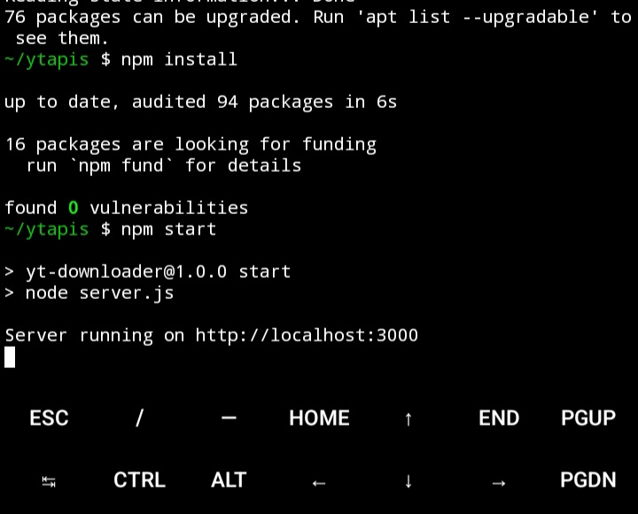
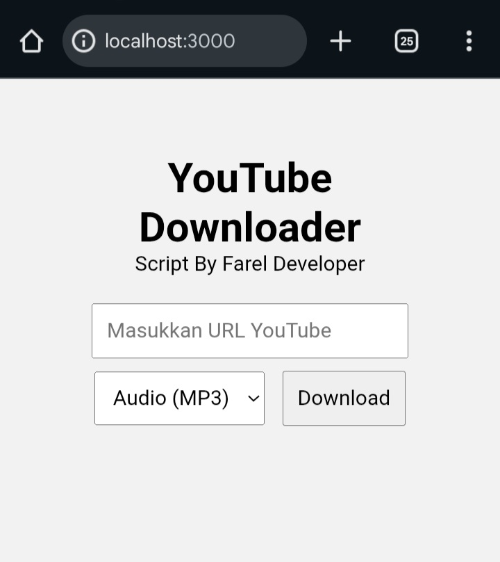
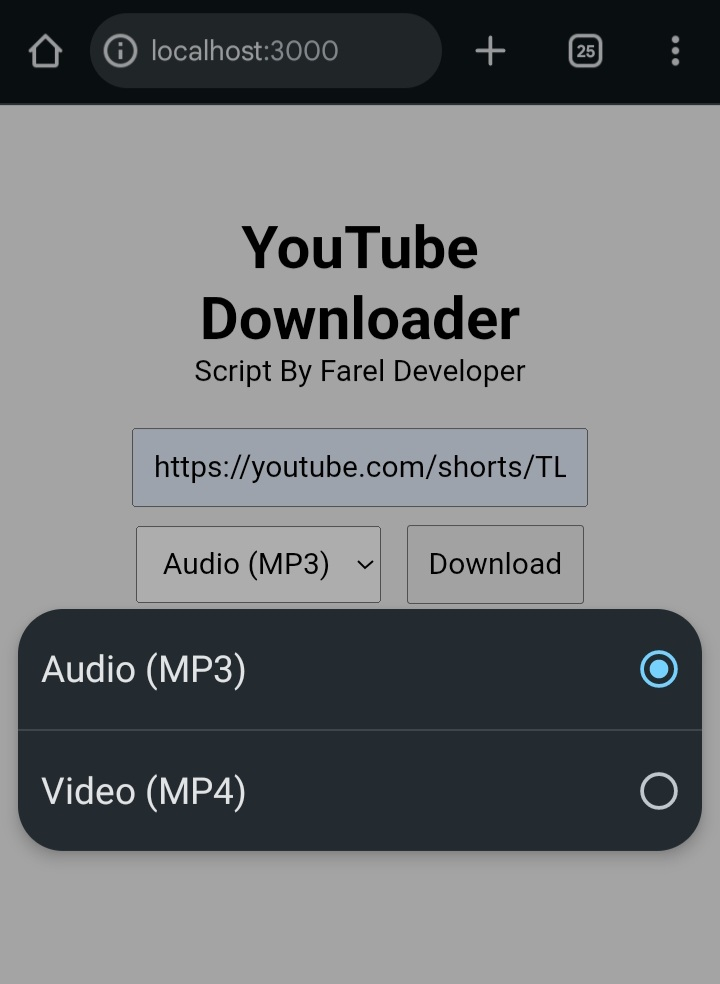
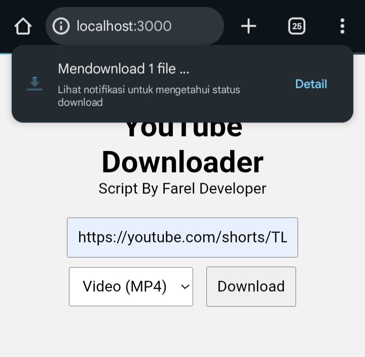

````markdown
# 🎬 YouTube Downloader (ytmp3 / ytmp4)

Proyek ini adalah aplikasi web sederhana untuk mengunduh **video YouTube (MP4)** atau **audio YouTube (MP3)**.  
Dibangun menggunakan **Node.js + Express + ytdl-core**.  
Mendukung penggunaan sebagai **website** maupun **API** untuk developer.

---

## 🚀 Fitur
- Input link YouTube → pilih format → klik download.
- Mendukung **MP3 (audio)** dan **MP4 (video)**.
- Endpoint API untuk integrasi dengan aplikasi lain.
- Tampilan web dengan loading animation.

---

## 📂 Instalasi

1. Clone repository:
   ```bash
   git clone https://github.com/fareldev-hub/youtube-downloader.git
   cd youtube-downloader
   ```


2. Install dependencies:

   ```bash
   npm install
   ```

3. Jalankan server:

   ```bash
   node server.js
   ```

4. Akses di browser:

   ```
   http://localhost:3000
   ```








---

## 🌐 Penggunaan Website

1. Masukkan URL YouTube di input.
2. Pilih format:

   * **Audio (MP3)**
   * **Video (MP4)**
3. Klik tombol **Download** → file otomatis terunduh.

---

## 🔗 API Endpoint

### **1. Download langsung**

```
GET /download?url=<YouTube_URL>&type=<ytmp3|ytmp4>
```

* **url** → link video YouTube
* **type** → `ytmp3` (audio) atau `ytmp4` (video)

📌 Contoh:

```
http://localhost:3000/download?url=https://www.youtube.com/watch?v=dQw4w9WgXcQ&type=ytmp3
```

---

### **2. API JSON Info**

```
GET /api/download?url=<YouTube_URL>&type=<ytmp3|ytmp4>
```

📌 Contoh response:

```json
{
  "title": "Rick Astley - Never Gonna Give You Up",
  "type": "ytmp3",
  "downloadUrl": "/download?url=https%3A%2F%2Fwww.youtube.com%2Fwatch%3Fv%3DdQw4w9WgXcQ&type=ytmp3"
}
```

---

## 💻 Contoh Penggunaan API

### cURL

```bash
curl -L "http://localhost:3000/download?url=https://www.youtube.com/watch?v=dQw4w9WgXcQ&type=ytmp4" -o video.mp4
```

### JavaScript (fetch)

```js
fetch("http://localhost:3000/download?url=https://www.youtube.com/watch?v=dQw4w9WgXcQ&type=ytmp3")
  .then(res => res.blob())
  .then(blob => {
    const a = document.createElement('a');
    a.href = URL.createObjectURL(blob);
    a.download = "audio.mp3";
    a.click();
  });
```

### Node.js (axios)

```js
const fs = require("fs");
const axios = require("axios");

(async () => {
  const url = "https://www.youtube.com/watch?v=dQw4w9WgXcQ";
  const res = await axios.get(`http://localhost:3000/download?url=${encodeURIComponent(url)}&type=ytmp4`, {
    responseType: "stream"
  });
  res.data.pipe(fs.createWriteStream("video.mp4"));
})();
```


---

## ⚠️ Catatan

* Tool ini hanya untuk **pembelajaran**.
* Gunakan secara bijak, jangan untuk distribusi ilegal konten berhak cipta.
* Selamat Menggunakan !!

---

## 👨‍💻 Author

**Farel Developer**
[🌐 Web](https://farel-alfareza-hub.vercel.app)